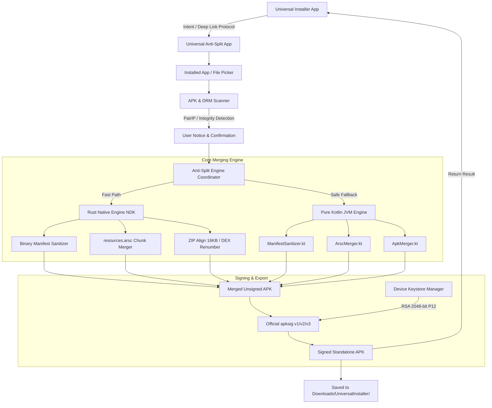

# Universal Anti-Split — Architecture & Implementation Plan

> **Universal Anti-Split** is a dedicated, high-performance Android companion application and standalone utility designed to merge Split APKs (AAB splits, XAPK, APKM, APKS) into a single, monolithic, self-contained APK file.

---

## 🎯 1. Project Vision & Mission

- **Clean Ecosystem Separation:** Keep [Universal Installer](https://github.com/pass-with-high-score/universal-installer) lightweight, compliant with Google Play Store & F-Droid policies, while offloading complex APK reconstruction and deep binary patching to this dedicated tool.
- **Extreme Performance:** Powered by a dual-engine architecture — an ultra-fast **Rust Native NDK Core** (`librust_antisplit.so`) with zero overhead, backed by a **Pure Kotlin JVM Fallback Engine**.
- **Open-Source & Secure by Design:** Employs on-device dynamic keystore generation (RSA 2048-bit + 30-year X.509 certificate) with Google's official `apksig` library supporting APK Signature Scheme v1, v2, and v3.
- **PairIP & Integrity Awareness:** Proactively detects Google Play Automatic Integrity Protection (`com.pairip.VMRunner`, `libpairipcore.so`) and signature-bound services (OAuth SHA-1, Play Integrity API) to provide actionable guidance to users.

---

## 🏗️ 2. Architectural Blueprint

---

## 🧩 3. Key Components & Implementation Details

### A. Binary AndroidManifest.xml Sanitizer
- Parses binary XML in-place without decompilation.
- Neutralizes split-declaring attributes in `AndroidManifest.xml`:
  - `split` → `__spt`
  - `configForSplit` → `__cfgForSplit`
  - `isFeatureSplit` → `__isFeatSplit`
  - `splitTypes` → `__sptTypes`
  - `requiredSplitTypes` → `__reqSplitTypes`
  - `isolatedSplits` → `__isoSplits`
- Strips Google Play Split metadata:
  - `com.android.vending.splits` → `com.android.vending.merged`
  - `com.android.vending.splits.required` → `com.android.vending.splits.merged__`

### B. resources.arsc Chunk Concatenation
- Traverses chunk headers (`RES_TABLE_TYPE = 0x0002`, `RES_TABLE_PACKAGE_TYPE = 0x0200`).
- Slices `ResTable_type` (0x0201) chunks from split resource tables and appends them into base table.
- Dynamically updates package chunk size and root resource table chunk size.

### C. ZIP Alignment & DEX Renumbering
- Re-indexes split DEX files sequentially (`classes2.dex`, `classes3.dex`, etc.).
- Preserves native shared libraries (`lib/<abi>/*.so`) stored uncompressed with 16KB / 4-byte alignment for Android 15+ compatibility.
- Strips obsolete signature metadata (`META-INF/*.SF`, `*.RSA`, `*.MF`).

### D. DRM / PairIP Inspection & Diagnostics
- Scans target split packages for:
  - `libpairipcore.so` and `com.pairip.VMRunner` (Google Play Automatic Integrity Protection).
  - SafetyNet / Play Integrity API references.
  - Google Sign-in / Firebase Auth OAuth SHA-1 dependencies.
- Explains to users whether an application can be safely run standalone or if integrity checks will prevent launch.

### E. On-Device Keystore & Official Signing
- Auto-generates local RSA 2048-bit keypair + self-signed certificate upon first run via BouncyCastle.
- Signs resulting APK using Google's official `com.android.tools.build:apksig` library supporting:
  - Scheme v1 (JAR signing for Android 5+)
  - Scheme v2 (Full APK signing for Android 7+)
  - Scheme v3 (Key rotation support for Android 9+)

---

## 🚀 4. Phased Roadmap

| Phase | Milestone | Scope |
| :---: | :--- | :--- |
| **Phase 1** | **Core Engine Setup** | Scaffolding Android project, porting Kotlin engine & Rust NDK engine, unit test suite with sample split APKs. |
| **Phase 2** | **Modern UI (Compose & M3)** | Dynamic Material 3 UI, app selector, split inspector, progress tracking with background worker. |
| **Phase 3** | **DRM & PairIP Diagnostics** | Automated pre-check for PairIP, split compatibility report, and smart recommendation dialog. |
| **Phase 4** | **Universal Installer Plugin Protocol** | Intent action `app.pwhs.universalinstaller.action.MERGE_SPLIT` to allow 1-click invocation from Universal Installer. |
| **Phase 5** | **Distribution & Releases** | GitHub Releases, F-Droid & IzzyOnDroid metadata, reproducible CI builds via GitHub Actions. |

---

## 📄 5. License & Credits

- **License:** GNU General Public License v3.0 (GPL-3.0)
- **Author:** Nguyen Quang Minh (NQM) — [pass-with-high-score](https://github.com/pass-with-high-score)
- **Sister Project:** [Universal Installer](https://github.com/pass-with-high-score/universal-installer)
