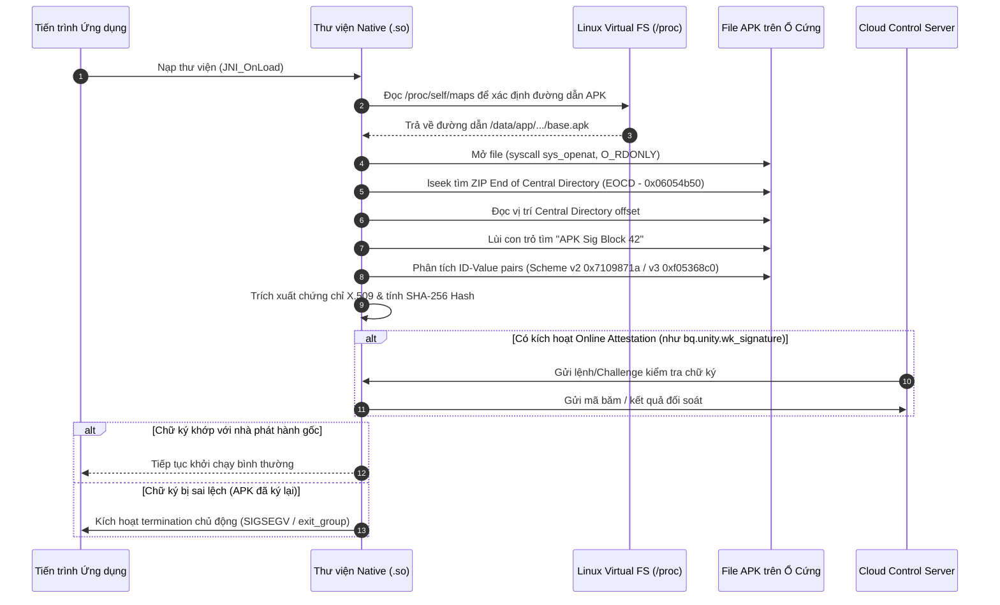

# Kiến Trúc & Quy Trình Kiểm Tra Chữ Ký Tầng Native (Android Native Integrity Verification Flow)

Tài liệu này mô tả chi tiết quy trình kỹ thuật, cấu trúc nhị phân và luồng thực thi mà các module bảo vệ tầng Native (như Wukong, Tencent ACE/MTP, hoặc các giải pháp bảo vệ game/ứng dụng) sử dụng để xác thực chữ ký và tính toàn vẹn của file APK trực tiếp bằng C/C++.

---

## 1. Sơ Đồ Tổng Quan Quy Trình (Flow Diagram)



---

## 2. Chi Tiết Các Giai Đoạn Kỹ Thuật

### Giai Đoạn 1: Định Vị File Cài Đặt (Self-APK Discovery)
Để không phụ thuộc vào `Context.getPackageCodePath()` ở tầng Java (vốn có thể bị giả lập), tầng Native tự tìm đường dẫn file APK của mình:
1. Mở file ảo `/proc/self/maps`.
2. Duyệt từng dòng ánh xạ bộ nhớ để tìm dòng có đuôi `.apk` với cờ quyền đọc (`r-xp` hoặc `r--p`).
3. Trích xuất đường dẫn tuyệt đối, ví dụ:  
   `/data/app/~~.../com.example.app-.../base.apk`

---

### Giai Đoạn 2: Xác Định Cấu Trúc Khối Chữ Ký Nhị Phân

File APK tuân theo chuẩn định dạng ZIP của Android với cấu trúc 4 phần:

```text
+-------------------------------------------------------------+
| 1. Dữ liệu các tệp nội dung (DEX, .so, assets, res...)      |
+-------------------------------------------------------------+
| 2. APK Signing Block (Kích thước: N bytes)                 |
|    - 8 bytes: Kích thước khối (Size of Block - uint64)      |
|    - ID-Value Pairs:                                        |
|        * ID 0x7109871a: Dữ liệu chữ ký Scheme v2            |
|        * ID 0xf05368c0: Dữ liệu chữ ký Scheme v3            |
|        * ID 0x1b93ae61: Source Stamp Block                  |
|    - 8 bytes: Kích thước khối lặp lại (uint64)              |
|    - 16 bytes: Magic String: "APK Sig Block 42"             |
+-------------------------------------------------------------+
| 3. Central Directory Headers (Danh mục các file ZIP)        |
+-------------------------------------------------------------+
| 4. End of Central Directory Record (EOCD - 22 bytes)        |
+-------------------------------------------------------------+
```

---

### Giai Đoạn 3: Thuật Toán Phân Tích Nhị Phân (Binary Parsing)

1. **Tìm EOCD**:
   - Dùng `lseek` tới cuối file và quét ngược trong khoảng 65KB cuối cùng để tìm chữ ký nhận dạng ZIP EOCD: `0x06054b50`.
   - Tại byte thứ 16 tính từ đầu EOCD, đọc giá trị `central_directory_offset` (4 bytes, Little-Endian).

2. **Kiểm tra Header "APK Sig Block 42"**:
   - Con trỏ file nhảy về `central_directory_offset - 16 bytes`.
   - Đọc 16 bytes và so sánh với Magic String:
     ```text
     ASCII: "APK Sig Block 42"
     HEX:   41 50 4B 20 53 69 67 20 42 6C 6F 63 6B 20 34 32
     ```
   - Nếu chuỗi khớp, file sử dụng APK Signature Scheme v2/v3.
   - Nhảy lùi tiếp 8 bytes để đọc tổng kích thước của khối `APK Signing Block`.

3. **Bóc tách Chứng Chỉ (Certificate Extraction)**:
   - Duyệt qua các cặp ID-Value trong khối:
     - Nhận diện ID `0x7109871a` (Scheme v2) hoặc `0xf05368c0` (Scheme v3).
     - Đọc mảng byte của danh sách người ký (Signers).
     - Lấy chứng chỉ X.509 ở định dạng DER (nhị phân).
   - Đưa chuỗi byte chứng chỉ qua thuật toán băm SHA-256 để tính `Digest`.

---

### Giai Đoạn 4: Đối Soát Tính Toàn Vẹn (Validation & Attestation)

Dữ liệu chứng chỉ sau khi bóc tách được kiểm tra qua 2 phương thức:
- **Kiểm tra ngoại tuyến (Offline Check)**:
  - So sánh trực tiếp mảng băm vừa tính với mảng băm hardcode được mã hóa rải rác bên trong các hàm native.
- **Kiểm tra trực tuyến (Online Policy Update)**:
  - Khi thiết lập kết nối đến máy chủ điều khiển (ví dụ server Cloud Control), máy chủ gửi tín hiệu kiểm tra định kỳ (như cờ cấu hình `wk_signature`).
  - Client tính toán lại chữ ký và gửi gói tin xác thực về máy chủ.

---

### Giai Đoạn 5: Cơ Chế Xử Lý Khi Sai Lệch (Enforcement Action)

Nếu phát hiện APK đã bị gộp và ký lại bằng khóa khác (như khóa debug hoặc custom keystore):
1. **Không sử dụng hộp thoại Java**: Hệ thống không gọi `Toast` hay `AlertDialog` của Android vì có thể bị can thiệp.
2. **Kích hoạt Crash chủ động**:
   - Cố tình truy xuất con trỏ `NULL` (ví dụ: `*(volatile int*)0 = 0`) để gửi tín hiệu `SIGSEGV` (Signal 11).
   - Hoặc làm lệch căn lề bộ nhớ / mmap nhằm tạo `SIGBUS` (Signal 7).
   - Hoặc gọi trực tiếp syscall `sys_exit_group` để buộc toàn bộ tiến trình dừng ngay lập tức mà không để lại Exception trên logcat thông thường.

---

## 3. Lý Do Java PMS Hook Không Tác Động Tới Luồng Này

| Tiêu chí | Java PMS Hook (Lớp Proxy) | Native Integrity Check (.so) |
| :--- | :--- | :--- |
| **Tầng thực thi** | JVM / ART Runtime (`IPackageManager`) | Linux Kernel syscalls & ELF Native Code |
| **Nguồn dữ liệu** | `PackageManager.getPackageInfo()` | Đọc trực tiếp byte nhị phân của file APK từ đĩa |
| **Khả năng bị chặn** | Bị kiểm soát bởi Dynamic Proxy trong Java | Bỏ qua hoàn toàn các biến `sPackageManager` trong `ActivityThread` |
| **Cơ chế phản hồi** | Trả về dữ liệu `Signature[]` giả lập | Tự tính mã băm SHA-256 trực tiếp từ file vật lý |
